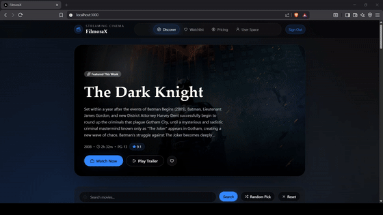
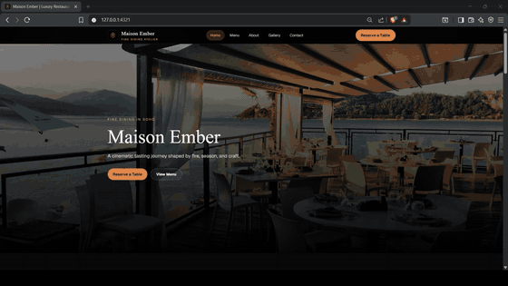
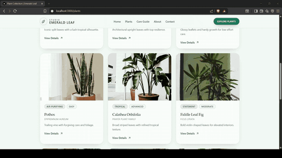
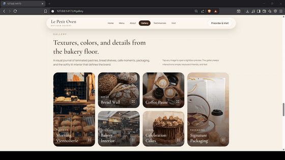
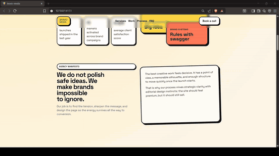

[![Aymane Bouljam banner][banner]][github]

[![Typing intro][typing]][github]

 

  //

  <strong>
    <tt>T E C H&nbsp;&nbsp;S T A C K</tt>
  </strong>

  

  
  

  
  
  

  
  
  
  

  
  
  

  
  

  

  //

  <strong>
    <tt>R E C E N T&nbsp;&nbsp;D R O P S</tt>
  </strong>

  

<table align="center">
  <tr>
    <td width="50%" valign="top">
      
01 // PET PANTRY

      
Playful storefront for dog food and accessories

      

        
        
        
        
      

      
    </td>
    <td width="50%" valign="top">
      
02 // FILMORAX

      
Movie streaming app with a polished browsing flow

      

        
        
        
        
      

      
    </td>
  </tr>
  <tr>
    <td width="50%" valign="top">
      
03 // MAISON EMBER

      
Multi-page restaurant showcase with a refined brand feel

      

        
        
        
      

      
    </td>
    <td width="50%" valign="top">
      
04 // NOMADIAN

      
Cinematic one-page luxury travel experience

      

        
        
        
        
      

      
    </td>
  </tr>
  <tr>
    <td width="50%" valign="top">
      
05 // EMERALD LEAF

      
Premium indoor-plant showcase with care-rich discovery

      

        
        
        
        
      

      
    </td>
    <td width="50%" valign="top">
      
06 // URBAN HAVEN

      
Premium real-estate showcase with polished inquiry flow

      

        
        
        
        
      

      
    </td>
  </tr>
</table>

<table align="center">
  <tr>
    <td width="50%" valign="top">
      
07 // FLEX ZONE

      
Modern gym showcase with bold, motion-led presentation

      

        
        
        
        
      

      
    </td>
    <td width="50%" valign="top">
      
08 // LE PETIT OVEN

      
Polished bakery showcase with a warm editorial feel

      

        
        
        
      

      
    </td>
  </tr>
  <tr>
    <td width="50%" valign="top">
      
09 // BRAVIO MEDIA

      
Modern single-page agency showcase

      

        
        
        
      

      
    </td>
    <td width="50%" valign="top"></td>
  </tr>
</table>

  //

  <strong>
    <tt>G I T H U B&nbsp;&nbsp;S T A T S</tt>
  </strong>

  <a href="https://github.com/bulljam">
    <picture>
      <source media="(prefers-color-scheme: dark)" srcset="https://github-readme-streak-stats.herokuapp.com?user=bulljam&hide_border=true&background=00000000&stroke=1f2937&ring=8b5cf6&fire=8b5cf6&currStreakLabel=6d28d9&sideNums=ffffff&currStreakNum=ffffff&dates=94a3b8&sideLabels=cbd5e1&card_width=980" />
      <source media="(prefers-color-scheme: light)" srcset="https://github-readme-streak-stats.herokuapp.com?user=bulljam&hide_border=true&background=00000000&stroke=e5e7eb&ring=6d28d9&fire=6d28d9&currStreakLabel=4c1d95&sideNums=1f2937&currStreakNum=1f2937&dates=475569&sideLabels=4c1d95&card_width=980" />
      
    </picture>
  </a>

  <a href="https://github.com/bulljam">
    <picture>
      <source media="(prefers-color-scheme: dark)" srcset="https://github-readme-activity-graph.vercel.app/graph?username=bulljam&bg_color=00000000&color=8b5cf6&line=6d28d9&point=ffffff&area=true&hide_border=true" />
      <source media="(prefers-color-scheme: light)" srcset="https://github-readme-activity-graph.vercel.app/graph?username=bulljam&bg_color=ffffff00&color=4c1d95&line=6d28d9&point=1f2937&area=true&hide_border=true" />
      
    </picture>
  </a>

  

  //

  <strong>
    <tt>C O N T A C T</tt>
  </strong>

 

  
  &nbsp;&nbsp;
  
  &nbsp;&nbsp;
  

  

[![Aymane Bouljam footer][footer-banner]][github]

[banner]: https://capsule-render.vercel.app/api?type=waving&height=160&color=0:0f172a,38:2e1065,72:4c1d95,100:8b5cf6&animation=twinkling
[footer-banner]: https://capsule-render.vercel.app/api?type=waving&section=footer&height=120&color=0:0f172a,38:2e1065,72:4c1d95,100:8b5cf6&animation=twinkling&reversal=true
[github]: https://github.com/bulljam
[typing]: https://readme-typing-svg.demolab.com?font=Space+Grotesk&weight=700&size=26&pause=1200&color=8B5CF6&center=true&vCenter=true&width=920&height=54&lines=Hey%2C+this+is+Aymane+Bouljam;Welcome+to+my+Hub%21
