[![Aymane Bouljam banner][banner]][github]

[![Typing intro][typing]][github]

 

  //

  <strong>
    <tt>W H O&nbsp;&nbsp;A M&nbsp;&nbsp;I</tt>
  </strong>

  

  //

  <strong>
    <tt>W H A T&nbsp;&nbsp;I&nbsp;&nbsp;D O</tt>
  </strong>

  

  //

  <strong>
    <tt>O N&nbsp;&nbsp;A I</tt>
  </strong>

  

  //

  <strong>
    <tt>M O T T O</tt>
  </strong>

  

  //

  <strong>
    <tt>T E C H&nbsp;&nbsp;S T A C K</tt>
  </strong>

  

  
  

  
  
  
  

  
  
  
  
  
  

  
  
  
  

  
  

  

  //

  <strong>
    <tt>R E C E N T&nbsp;&nbsp;D R O P S</tt>
  </strong>

  

  
<strong>Frontend Showcase</strong>

   

<table align="center">
  <tr>
    <td width="50%" valign="top">
      
<strong>01 // PET PANTRY</strong>

      

        <picture>
          <source media="(prefers-color-scheme: dark)" srcset="demo/descriptions/pet-pantry.svg" />
          <source media="(prefers-color-scheme: light)" srcset="demo/descriptions/pet-pantry-light.svg" />
          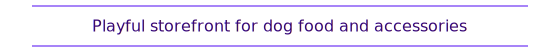
        </picture>
      

      

        <picture><source media="(prefers-color-scheme: dark)" srcset="https://cdn.simpleicons.org/reactrouter/ffffff" /><source media="(prefers-color-scheme: light)" srcset="https://cdn.simpleicons.org/reactrouter/6d28d9" /></picture>
        <picture><source media="(prefers-color-scheme: dark)" srcset="https://cdn.simpleicons.org/bun/ffffff" /><source media="(prefers-color-scheme: light)" srcset="https://cdn.simpleicons.org/bun/6d28d9" /></picture>
        <picture><source media="(prefers-color-scheme: dark)" srcset="https://cdn.simpleicons.org/tailwindcss/ffffff" /><source media="(prefers-color-scheme: light)" srcset="https://cdn.simpleicons.org/tailwindcss/6d28d9" /></picture>
        <picture><source media="(prefers-color-scheme: dark)" srcset="https://cdn.simpleicons.org/shadcnui/ffffff" /><source media="(prefers-color-scheme: light)" srcset="https://cdn.simpleicons.org/shadcnui/6d28d9" /></picture>
      

      <a href="https://github.com/bulljam/Pet-Pantry" title="Open Pet Pantry repository">
        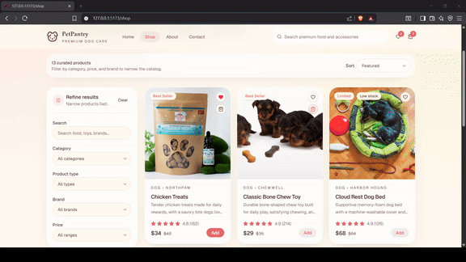
      </a>
    </td>
    <td width="50%" valign="top">
      
<strong>02 // FILMORAX</strong>

      

        <picture>
          <source media="(prefers-color-scheme: dark)" srcset="demo/descriptions/filmorax.svg" />
          <source media="(prefers-color-scheme: light)" srcset="demo/descriptions/filmorax-light.svg" />
          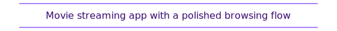
        </picture>
      

      

        <picture><source media="(prefers-color-scheme: dark)" srcset="https://cdn.simpleicons.org/nextdotjs/ffffff" /><source media="(prefers-color-scheme: light)" srcset="https://cdn.simpleicons.org/nextdotjs/6d28d9" /></picture>
        <picture><source media="(prefers-color-scheme: dark)" srcset="https://cdn.simpleicons.org/tailwindcss/ffffff" /><source media="(prefers-color-scheme: light)" srcset="https://cdn.simpleicons.org/tailwindcss/6d28d9" /></picture>
        <picture><source media="(prefers-color-scheme: dark)" srcset="https://cdn.simpleicons.org/shadcnui/ffffff" /><source media="(prefers-color-scheme: light)" srcset="https://cdn.simpleicons.org/shadcnui/6d28d9" /></picture>
        <picture><source media="(prefers-color-scheme: dark)" srcset="https://cdn.simpleicons.org/supabase/ffffff" /><source media="(prefers-color-scheme: light)" srcset="https://cdn.simpleicons.org/supabase/6d28d9" /></picture>
      

      
    </td>
  </tr>
  <tr>
    <td width="50%" valign="top">
      
<strong>03 // MAISON EMBER</strong>

      

        <picture>
          <source media="(prefers-color-scheme: dark)" srcset="demo/descriptions/maison-ember.svg" />
          <source media="(prefers-color-scheme: light)" srcset="demo/descriptions/maison-ember-light.svg" />
          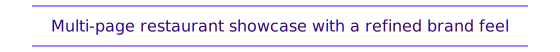
        </picture>
      

      

        <picture><source media="(prefers-color-scheme: dark)" srcset="https://cdn.simpleicons.org/astro/ffffff" /><source media="(prefers-color-scheme: light)" srcset="https://cdn.simpleicons.org/astro/6d28d9" /></picture>
        <picture><source media="(prefers-color-scheme: dark)" srcset="https://cdn.simpleicons.org/tailwindcss/ffffff" /><source media="(prefers-color-scheme: light)" srcset="https://cdn.simpleicons.org/tailwindcss/6d28d9" /></picture>
        <picture><source media="(prefers-color-scheme: dark)" srcset="https://cdn.simpleicons.org/mailtrap/ffffff" /><source media="(prefers-color-scheme: light)" srcset="https://cdn.simpleicons.org/mailtrap/6d28d9" /></picture>
      

      
    </td>
    <td width="50%" valign="top">
      
<strong>04 // NOMADIAN</strong>

      

        <picture>
          <source media="(prefers-color-scheme: dark)" srcset="demo/descriptions/nomadian.svg" />
          <source media="(prefers-color-scheme: light)" srcset="demo/descriptions/nomadian-light.svg" />
          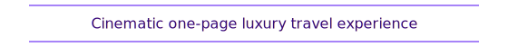
        </picture>
      

      

        <picture><source media="(prefers-color-scheme: dark)" srcset="https://cdn.simpleicons.org/svelte/ffffff" /><source media="(prefers-color-scheme: light)" srcset="https://cdn.simpleicons.org/svelte/6d28d9" /></picture>
        <picture><source media="(prefers-color-scheme: dark)" srcset="https://cdn.simpleicons.org/lucide/ffffff" /><source media="(prefers-color-scheme: light)" srcset="https://cdn.simpleicons.org/lucide/6d28d9" /></picture>
        <picture><source media="(prefers-color-scheme: dark)" srcset="https://cdn.simpleicons.org/tailwindcss/ffffff" /><source media="(prefers-color-scheme: light)" srcset="https://cdn.simpleicons.org/tailwindcss/6d28d9" /></picture>
        <picture><source media="(prefers-color-scheme: dark)" srcset="https://cdn.simpleicons.org/greensock/ffffff" /><source media="(prefers-color-scheme: light)" srcset="https://cdn.simpleicons.org/greensock/6d28d9" /></picture>
      

      <a href="https://github.com/bulljam/Nomadian" title="Open Nomadian repository">
        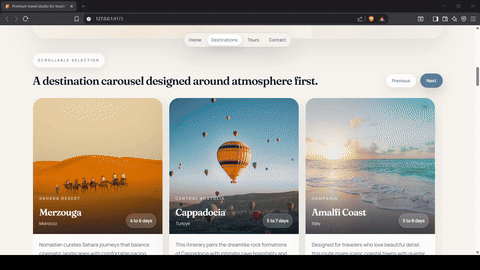
      </a>
    </td>
  </tr>
  <tr>
    <td width="50%" valign="top">
      
<strong>05 // EMERALD LEAF</strong>

      

        <picture>
          <source media="(prefers-color-scheme: dark)" srcset="demo/descriptions/emerald-leaf.svg" />
          <source media="(prefers-color-scheme: light)" srcset="demo/descriptions/emerald-leaf-light.svg" />
          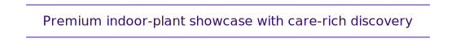
        </picture>
      

      

        <picture><source media="(prefers-color-scheme: dark)" srcset="https://cdn.simpleicons.org/nextdotjs/ffffff" /><source media="(prefers-color-scheme: light)" srcset="https://cdn.simpleicons.org/nextdotjs/6d28d9" /></picture>
        <picture><source media="(prefers-color-scheme: dark)" srcset="https://cdn.simpleicons.org/tailwindcss/ffffff" /><source media="(prefers-color-scheme: light)" srcset="https://cdn.simpleicons.org/tailwindcss/6d28d9" /></picture>
        <picture><source media="(prefers-color-scheme: dark)" srcset="https://cdn.simpleicons.org/shadcnui/ffffff" /><source media="(prefers-color-scheme: light)" srcset="https://cdn.simpleicons.org/shadcnui/6d28d9" /></picture>
        <picture><source media="(prefers-color-scheme: dark)" srcset="https://cdn.simpleicons.org/framer/ffffff" /><source media="(prefers-color-scheme: light)" srcset="https://cdn.simpleicons.org/framer/6d28d9" /></picture>
      

      
    </td>
    <td width="50%" valign="top">
      
<strong>06 // URBAN PILLARS</strong>

      

        <picture>
          <source media="(prefers-color-scheme: dark)" srcset="demo/descriptions/urban-pillars.svg" />
          <source media="(prefers-color-scheme: light)" srcset="demo/descriptions/urban-pillars-light.svg" />
          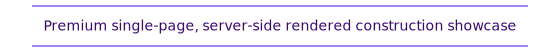
        </picture>
      

      

        <picture><source media="(prefers-color-scheme: dark)" srcset="https://cdn.simpleicons.org/bun/ffffff" /><source media="(prefers-color-scheme: light)" srcset="https://cdn.simpleicons.org/bun/6d28d9" /></picture>
        <picture><source media="(prefers-color-scheme: dark)" srcset="https://cdn.simpleicons.org/express/ffffff" /><source media="(prefers-color-scheme: light)" srcset="https://cdn.simpleicons.org/express/6d28d9" /></picture>
        <picture><source media="(prefers-color-scheme: dark)" srcset="https://cdn.simpleicons.org/ejs/ffffff" /><source media="(prefers-color-scheme: light)" srcset="https://cdn.simpleicons.org/ejs/6d28d9" /></picture>
        <picture><source media="(prefers-color-scheme: dark)" srcset="https://cdn.simpleicons.org/htmx/ffffff" /><source media="(prefers-color-scheme: light)" srcset="https://cdn.simpleicons.org/htmx/6d28d9" /></picture>
        <picture><source media="(prefers-color-scheme: dark)" srcset="https://cdn.simpleicons.org/css/ffffff" /><source media="(prefers-color-scheme: light)" srcset="https://cdn.simpleicons.org/css/6d28d9" /></picture>
      

      <a href="https://github.com/bulljam/Urban-Pillars.git" title="Open Urban Pillars repository">
        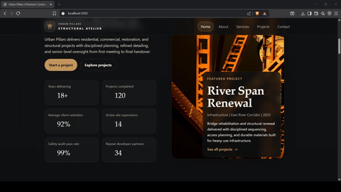
      </a>
    </td>
  </tr>
</table>

<table align="center">
  <tr>
    <td width="50%" valign="top">
      
<strong>07 // FLEX ZONE</strong>

      

        <picture>
          <source media="(prefers-color-scheme: dark)" srcset="demo/descriptions/flex-zone.svg" />
          <source media="(prefers-color-scheme: light)" srcset="demo/descriptions/flex-zone-light.svg" />
          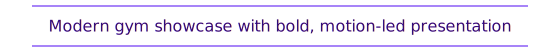
        </picture>
      

      

        <picture><source media="(prefers-color-scheme: dark)" srcset="https://cdn.simpleicons.org/nextdotjs/ffffff" /><source media="(prefers-color-scheme: light)" srcset="https://cdn.simpleicons.org/nextdotjs/6d28d9" /></picture>
        <picture><source media="(prefers-color-scheme: dark)" srcset="https://cdn.simpleicons.org/tailwindcss/ffffff" /><source media="(prefers-color-scheme: light)" srcset="https://cdn.simpleicons.org/tailwindcss/6d28d9" /></picture>
        <picture><source media="(prefers-color-scheme: dark)" srcset="https://cdn.simpleicons.org/shadcnui/ffffff" /><source media="(prefers-color-scheme: light)" srcset="https://cdn.simpleicons.org/shadcnui/6d28d9" /></picture>
        <picture><source media="(prefers-color-scheme: dark)" srcset="https://cdn.simpleicons.org/framer/ffffff" /><source media="(prefers-color-scheme: light)" srcset="https://cdn.simpleicons.org/framer/6d28d9" /></picture>
      

      <a href="https://github.com/bulljam/Flex-zone" title="Open Flex Zone repository">
        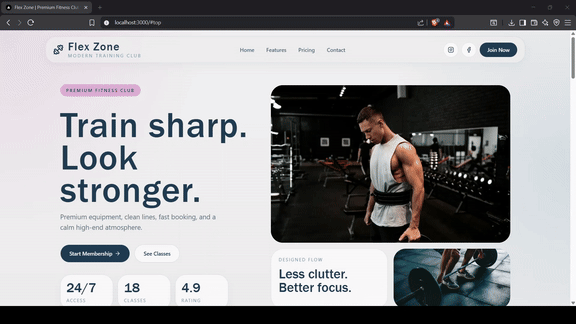
      </a>
    </td>
    <td width="50%" valign="top">
      
<strong>08 // LE PETIT OVEN</strong>

      

        <picture>
          <source media="(prefers-color-scheme: dark)" srcset="demo/descriptions/le-petit-oven.svg" />
          <source media="(prefers-color-scheme: light)" srcset="demo/descriptions/le-petit-oven-light.svg" />
          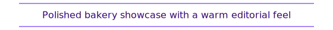
        </picture>
      

      

        <picture><source media="(prefers-color-scheme: dark)" srcset="https://cdn.simpleicons.org/solid/ffffff" /><source media="(prefers-color-scheme: light)" srcset="https://cdn.simpleicons.org/solid/6d28d9" /></picture>
        <picture><source media="(prefers-color-scheme: dark)" srcset="https://cdn.simpleicons.org/bun/ffffff" /><source media="(prefers-color-scheme: light)" srcset="https://cdn.simpleicons.org/bun/6d28d9" /></picture>
        <picture><source media="(prefers-color-scheme: dark)" srcset="https://cdn.simpleicons.org/tailwindcss/ffffff" /><source media="(prefers-color-scheme: light)" srcset="https://cdn.simpleicons.org/tailwindcss/6d28d9" /></picture>
      

      
    </td>
  </tr>
  <tr>
    <td width="50%" valign="top">
      
<strong>09 // BRAVIO MEDIA</strong>

      

        <picture>
          <source media="(prefers-color-scheme: dark)" srcset="demo/descriptions/bravio-media.svg" />
          <source media="(prefers-color-scheme: light)" srcset="demo/descriptions/bravio-media-light.svg" />
          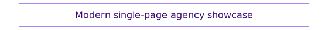
        </picture>
      

      

        <picture><source media="(prefers-color-scheme: dark)" srcset="https://cdn.simpleicons.org/react/ffffff" /><source media="(prefers-color-scheme: light)" srcset="https://cdn.simpleicons.org/react/6d28d9" /></picture>
        <picture><source media="(prefers-color-scheme: dark)" srcset="https://cdn.simpleicons.org/typescript/ffffff" /><source media="(prefers-color-scheme: light)" srcset="https://cdn.simpleicons.org/typescript/6d28d9" /></picture>
        <picture><source media="(prefers-color-scheme: dark)" srcset="https://cdn.simpleicons.org/css/ffffff" /><source media="(prefers-color-scheme: light)" srcset="https://cdn.simpleicons.org/css/6d28d9" /></picture>
      

      
    </td>
    <td width="50%" valign="top">
      
<strong>10 // URBAN HAVEN</strong>

      

        <picture>
          <source media="(prefers-color-scheme: dark)" srcset="demo/descriptions/urban-haven.svg" />
          <source media="(prefers-color-scheme: light)" srcset="demo/descriptions/urban-haven-light.svg" />
          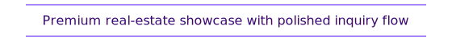
        </picture>
      

      

        <picture><source media="(prefers-color-scheme: dark)" srcset="https://cdn.simpleicons.org/nuxt/ffffff" /><source media="(prefers-color-scheme: light)" srcset="https://cdn.simpleicons.org/nuxt/6d28d9" /></picture>
        <picture><source media="(prefers-color-scheme: dark)" srcset="https://cdn.simpleicons.org/daisyui/ffffff" /><source media="(prefers-color-scheme: light)" srcset="https://cdn.simpleicons.org/daisyui/6d28d9" /></picture>
        <picture><source media="(prefers-color-scheme: dark)" srcset="https://cdn.simpleicons.org/greensock/ffffff" /><source media="(prefers-color-scheme: light)" srcset="https://cdn.simpleicons.org/greensock/6d28d9" /></picture>
        <picture><source media="(prefers-color-scheme: dark)" srcset="https://cdn.simpleicons.org/mailtrap/ffffff" /><source media="(prefers-color-scheme: light)" srcset="https://cdn.simpleicons.org/mailtrap/6d28d9" /></picture>
      

      <a href="https://github.com/bulljam/Urban-Haven" title="Open Urban Haven repository">
        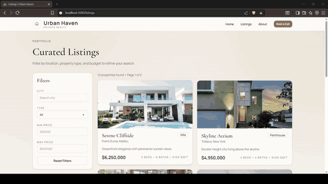
      </a>
    </td>
  </tr>
</table>

  
<strong>API Showcase</strong>

   

<table align="center">
  <tr>
    <td width="50%" valign="top">
      
<strong>01 // STOREX API</strong>

      

        <picture>
          <source media="(prefers-color-scheme: dark)" srcset="demo/descriptions/storex-api.svg" />
          <source media="(prefers-color-scheme: light)" srcset="demo/descriptions/storex-api-light.svg" />
          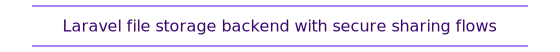
        </picture>
      

      

        <picture><source media="(prefers-color-scheme: dark)" srcset="https://cdn.simpleicons.org/php/ffffff" /><source media="(prefers-color-scheme: light)" srcset="https://cdn.simpleicons.org/php/6d28d9" /></picture>
        <picture><source media="(prefers-color-scheme: dark)" srcset="https://cdn.simpleicons.org/laravel/ffffff" /><source media="(prefers-color-scheme: light)" srcset="https://cdn.simpleicons.org/laravel/6d28d9" /></picture>
        <picture><source media="(prefers-color-scheme: dark)" srcset="https://cdn.simpleicons.org/postgresql/ffffff" /><source media="(prefers-color-scheme: light)" srcset="https://cdn.simpleicons.org/postgresql/6d28d9" /></picture>
        <picture><source media="(prefers-color-scheme: dark)" srcset="https://cdn.simpleicons.org/swagger/ffffff" /><source media="(prefers-color-scheme: light)" srcset="https://cdn.simpleicons.org/swagger/6d28d9" /></picture>
      

      
    </td>
    <td width="50%" valign="top">
      
<strong>02 // ROOMRESERVE API</strong>

      

        <picture>
          <source media="(prefers-color-scheme: dark)" srcset="demo/descriptions/roomreserve-api.svg" />
          <source media="(prefers-color-scheme: light)" srcset="demo/descriptions/roomreserve-api-light.svg" />
          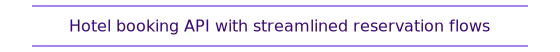
        </picture>
      

      

        <picture><source media="(prefers-color-scheme: dark)" srcset="https://cdn.simpleicons.org/typescript/ffffff" /><source media="(prefers-color-scheme: light)" srcset="https://cdn.simpleicons.org/typescript/6d28d9" /></picture>
        <picture><source media="(prefers-color-scheme: dark)" srcset="https://cdn.simpleicons.org/fastify/ffffff" /><source media="(prefers-color-scheme: light)" srcset="https://cdn.simpleicons.org/fastify/6d28d9" /></picture>
        <picture><source media="(prefers-color-scheme: dark)" srcset="https://cdn.simpleicons.org/postgresql/ffffff" /><source media="(prefers-color-scheme: light)" srcset="https://cdn.simpleicons.org/postgresql/6d28d9" /></picture>
        <picture><source media="(prefers-color-scheme: dark)" srcset="https://cdn.simpleicons.org/prisma/ffffff" /><source media="(prefers-color-scheme: light)" srcset="https://cdn.simpleicons.org/prisma/6d28d9" /></picture>
      

      
    </td>
  </tr>
  <tr>
    <td width="50%" valign="top">
      
<strong>03 // BLINK API</strong>

      

        <picture>
          <source media="(prefers-color-scheme: dark)" srcset="demo/descriptions/blink-api.svg" />
          <source media="(prefers-color-scheme: light)" srcset="demo/descriptions/blink-api-light.svg" />
          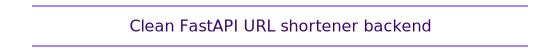
        </picture>
      

      

        <picture><source media="(prefers-color-scheme: dark)" srcset="https://cdn.simpleicons.org/python/ffffff" /><source media="(prefers-color-scheme: light)" srcset="https://cdn.simpleicons.org/python/6d28d9" /></picture>
        <picture><source media="(prefers-color-scheme: dark)" srcset="https://cdn.simpleicons.org/fastapi/ffffff" /><source media="(prefers-color-scheme: light)" srcset="https://cdn.simpleicons.org/fastapi/6d28d9" /></picture>
        <picture><source media="(prefers-color-scheme: dark)" srcset="https://cdn.simpleicons.org/postgresql/ffffff" /><source media="(prefers-color-scheme: light)" srcset="https://cdn.simpleicons.org/postgresql/6d28d9" /></picture>
        <picture><source media="(prefers-color-scheme: dark)" srcset="https://cdn.simpleicons.org/pydantic/ffffff" /><source media="(prefers-color-scheme: light)" srcset="https://cdn.simpleicons.org/pydantic/6d28d9" /></picture>
      

      
    </td>
    <td width="50%" valign="top">
      
<strong>04 // AUTHCORE API</strong>

      

        <picture>
          <source media="(prefers-color-scheme: dark)" srcset="demo/descriptions/authcore-api.svg" />
          <source media="(prefers-color-scheme: light)" srcset="demo/descriptions/authcore-api-light.svg" />
          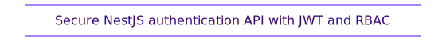
        </picture>
      

      

        <picture><source media="(prefers-color-scheme: dark)" srcset="https://cdn.simpleicons.org/typescript/ffffff" /><source media="(prefers-color-scheme: light)" srcset="https://cdn.simpleicons.org/typescript/6d28d9" /></picture>
        <picture><source media="(prefers-color-scheme: dark)" srcset="https://cdn.simpleicons.org/nestjs/ffffff" /><source media="(prefers-color-scheme: light)" srcset="https://cdn.simpleicons.org/nestjs/6d28d9" /></picture>
        <picture><source media="(prefers-color-scheme: dark)" srcset="https://cdn.simpleicons.org/postgresql/ffffff" /><source media="(prefers-color-scheme: light)" srcset="https://cdn.simpleicons.org/postgresql/6d28d9" /></picture>
        <picture><source media="(prefers-color-scheme: dark)" srcset="https://cdn.simpleicons.org/prisma/ffffff" /><source media="(prefers-color-scheme: light)" srcset="https://cdn.simpleicons.org/prisma/6d28d9" /></picture>
      

      
    </td>
  </tr>
  <tr>
    <td width="50%" valign="top">
      
<strong>05 // INVOICEKIT API</strong>

      

        <picture>
          <source media="(prefers-color-scheme: dark)" srcset="demo/descriptions/invoicekit-api.svg" />
          <source media="(prefers-color-scheme: light)" srcset="demo/descriptions/invoicekit-api-light.svg" />
          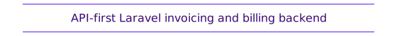
        </picture>
      

      

        <picture><source media="(prefers-color-scheme: dark)" srcset="https://cdn.simpleicons.org/php/ffffff" /><source media="(prefers-color-scheme: light)" srcset="https://cdn.simpleicons.org/php/6d28d9" /></picture>
        <picture><source media="(prefers-color-scheme: dark)" srcset="https://cdn.simpleicons.org/laravel/ffffff" /><source media="(prefers-color-scheme: light)" srcset="https://cdn.simpleicons.org/laravel/6d28d9" /></picture>
        <picture><source media="(prefers-color-scheme: dark)" srcset="https://cdn.simpleicons.org/postgresql/ffffff" /><source media="(prefers-color-scheme: light)" srcset="https://cdn.simpleicons.org/postgresql/6d28d9" /></picture>
        <picture><source media="(prefers-color-scheme: dark)" srcset="https://cdn.simpleicons.org/swagger/ffffff" /><source media="(prefers-color-scheme: light)" srcset="https://cdn.simpleicons.org/swagger/6d28d9" /></picture>
      

      
    </td>
    <td width="50%" valign="top">
      
<strong>06 // EXPENSEKIT API</strong>

      

        <picture>
          <source media="(prefers-color-scheme: dark)" srcset="demo/descriptions/expensekit-api.svg" />
          <source media="(prefers-color-scheme: light)" srcset="demo/descriptions/expensekit-api-light.svg" />
          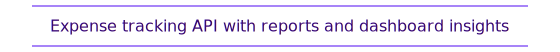
        </picture>
      

      

        <picture><source media="(prefers-color-scheme: dark)" srcset="https://cdn.simpleicons.org/php/ffffff" /><source media="(prefers-color-scheme: light)" srcset="https://cdn.simpleicons.org/php/6d28d9" /></picture>
        <picture><source media="(prefers-color-scheme: dark)" srcset="https://cdn.simpleicons.org/laravel/ffffff" /><source media="(prefers-color-scheme: light)" srcset="https://cdn.simpleicons.org/laravel/6d28d9" /></picture>
        <picture><source media="(prefers-color-scheme: dark)" srcset="https://cdn.simpleicons.org/postgresql/ffffff" /><source media="(prefers-color-scheme: light)" srcset="https://cdn.simpleicons.org/postgresql/6d28d9" /></picture>
        <picture><source media="(prefers-color-scheme: dark)" srcset="https://cdn.simpleicons.org/swagger/ffffff" /><source media="(prefers-color-scheme: light)" srcset="https://cdn.simpleicons.org/swagger/6d28d9" /></picture>
      

      
    </td>
  </tr>
  <tr>
    <td width="50%" valign="top">
      
<strong>07 // EDUCORE API</strong>

      

        <picture>
          <source media="(prefers-color-scheme: dark)" srcset="demo/descriptions/educore-api.svg" />
          <source media="(prefers-color-scheme: light)" srcset="demo/descriptions/educore-api-light.svg" />
          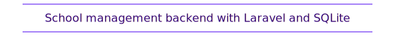
        </picture>
      

      

        <picture><source media="(prefers-color-scheme: dark)" srcset="https://cdn.simpleicons.org/php/ffffff" /><source media="(prefers-color-scheme: light)" srcset="https://cdn.simpleicons.org/php/6d28d9" /></picture>
        <picture><source media="(prefers-color-scheme: dark)" srcset="https://cdn.simpleicons.org/laravel/ffffff" /><source media="(prefers-color-scheme: light)" srcset="https://cdn.simpleicons.org/laravel/6d28d9" /></picture>
        <picture><source media="(prefers-color-scheme: dark)" srcset="https://cdn.simpleicons.org/sqlite/ffffff" /><source media="(prefers-color-scheme: light)" srcset="https://cdn.simpleicons.org/sqlite/6d28d9" /></picture>
        <picture><source media="(prefers-color-scheme: dark)" srcset="https://cdn.simpleicons.org/swagger/ffffff" /><source media="(prefers-color-scheme: light)" srcset="https://cdn.simpleicons.org/swagger/6d28d9" /></picture>
      

      
    </td>
    <td width="50%" valign="top">
      
<strong>08 // LIBRARYCORE API</strong>

      

        <picture>
          <source media="(prefers-color-scheme: dark)" srcset="demo/descriptions/librarycore-api.svg" />
          <source media="(prefers-color-scheme: light)" srcset="demo/descriptions/librarycore-api-light.svg" />
          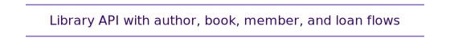
        </picture>
      

      

        <picture><source media="(prefers-color-scheme: dark)" srcset="https://cdn.simpleicons.org/php/ffffff" /><source media="(prefers-color-scheme: light)" srcset="https://cdn.simpleicons.org/php/6d28d9" /></picture>
        <picture><source media="(prefers-color-scheme: dark)" srcset="https://cdn.simpleicons.org/laravel/ffffff" /><source media="(prefers-color-scheme: light)" srcset="https://cdn.simpleicons.org/laravel/6d28d9" /></picture>
        <picture><source media="(prefers-color-scheme: dark)" srcset="https://cdn.simpleicons.org/sqlite/ffffff" /><source media="(prefers-color-scheme: light)" srcset="https://cdn.simpleicons.org/sqlite/6d28d9" /></picture>
        <picture><source media="(prefers-color-scheme: dark)" srcset="https://cdn.simpleicons.org/swagger/ffffff" /><source media="(prefers-color-scheme: light)" srcset="https://cdn.simpleicons.org/swagger/6d28d9" /></picture>
      

      
    </td>
  </tr>
  <tr>
    <td width="50%" valign="top">
      
<strong>09 // LEXICORE API</strong>

      

        <picture>
          <source media="(prefers-color-scheme: dark)" srcset="demo/descriptions/lexicore-api.svg" />
          <source media="(prefers-color-scheme: light)" srcset="demo/descriptions/lexicore-api-light.svg" />
          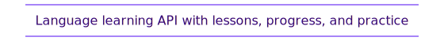
        </picture>
      

      

        <picture><source media="(prefers-color-scheme: dark)" srcset="https://cdn.simpleicons.org/php/ffffff" /><source media="(prefers-color-scheme: light)" srcset="https://cdn.simpleicons.org/php/6d28d9" /></picture>
        <picture><source media="(prefers-color-scheme: dark)" srcset="https://cdn.simpleicons.org/laravel/ffffff" /><source media="(prefers-color-scheme: light)" srcset="https://cdn.simpleicons.org/laravel/6d28d9" /></picture>
        <picture><source media="(prefers-color-scheme: dark)" srcset="https://cdn.simpleicons.org/sqlite/ffffff" /><source media="(prefers-color-scheme: light)" srcset="https://cdn.simpleicons.org/sqlite/6d28d9" /></picture>
        <picture><source media="(prefers-color-scheme: dark)" srcset="https://cdn.simpleicons.org/swagger/ffffff" /><source media="(prefers-color-scheme: light)" srcset="https://cdn.simpleicons.org/swagger/6d28d9" /></picture>
      

      
    </td>
    <td width="50%" valign="top">
      
<strong>10 // DRIVECORE API</strong>

      

        <picture>
          <source media="(prefers-color-scheme: dark)" srcset="demo/descriptions/drivecore-api.svg" />
          <source media="(prefers-color-scheme: light)" srcset="demo/descriptions/drivecore-api-light.svg" />
          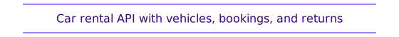
        </picture>
      

      

        <picture><source media="(prefers-color-scheme: dark)" srcset="https://cdn.simpleicons.org/php/ffffff" /><source media="(prefers-color-scheme: light)" srcset="https://cdn.simpleicons.org/php/6d28d9" /></picture>
        <picture><source media="(prefers-color-scheme: dark)" srcset="https://cdn.simpleicons.org/laravel/ffffff" /><source media="(prefers-color-scheme: light)" srcset="https://cdn.simpleicons.org/laravel/6d28d9" /></picture>
        <picture><source media="(prefers-color-scheme: dark)" srcset="https://cdn.simpleicons.org/sqlite/ffffff" /><source media="(prefers-color-scheme: light)" srcset="https://cdn.simpleicons.org/sqlite/6d28d9" /></picture>
        <picture><source media="(prefers-color-scheme: dark)" srcset="https://cdn.simpleicons.org/swagger/ffffff" /><source media="(prefers-color-scheme: light)" srcset="https://cdn.simpleicons.org/swagger/6d28d9" /></picture>
      

      
    </td>
  </tr>
</table>

  //

  <strong>
    <tt>G I T H U B&nbsp;&nbsp;S T A T S</tt>
  </strong>

  <a href="https://github.com/bulljam">
    <picture>
      <source media="(prefers-color-scheme: dark)" srcset="https://github-readme-streak-stats.herokuapp.com?user=bulljam&hide_border=true&background=00000000&stroke=1f2937&ring=8b5cf6&fire=8b5cf6&currStreakLabel=6d28d9&sideNums=ffffff&currStreakNum=ffffff&dates=94a3b8&sideLabels=cbd5e1&card_width=980" />
      <source media="(prefers-color-scheme: light)" srcset="https://github-readme-streak-stats.herokuapp.com?user=bulljam&hide_border=true&background=00000000&stroke=e5e7eb&ring=6d28d9&fire=6d28d9&currStreakLabel=4c1d95&sideNums=1f2937&currStreakNum=1f2937&dates=475569&sideLabels=4c1d95&card_width=980" />
      
    </picture>
  </a>

  <a href="https://github.com/bulljam">
    <picture>
      <source media="(prefers-color-scheme: dark)" srcset="https://github-readme-activity-graph.vercel.app/graph?username=bulljam&bg_color=00000000&color=8b5cf6&line=6d28d9&point=ffffff&area=true&hide_border=true" />
      <source media="(prefers-color-scheme: light)" srcset="https://github-readme-activity-graph.vercel.app/graph?username=bulljam&bg_color=ffffff00&color=4c1d95&line=6d28d9&point=1f2937&area=true&hide_border=true" />
      
    </picture>
  </a>

  

  //

  <strong>
    <tt>F I N D&nbsp;&nbsp;M E</tt>
  </strong>

 

  
  &nbsp;&nbsp;
  
  &nbsp;&nbsp;
  

  

[![Aymane Bouljam footer][footer-banner]][github]

[banner]: https://capsule-render.vercel.app/api?type=waving&height=160&color=0:0f172a,38:2e1065,72:4c1d95,100:8b5cf6&animation=twinkling
[footer-banner]: https://capsule-render.vercel.app/api?type=waving&section=footer&height=120&color=0:0f172a,38:2e1065,72:4c1d95,100:8b5cf6&animation=twinkling&reversal=true
[github]: https://github.com/bulljam
[typing]: https://readme-typing-svg.demolab.com?font=Space+Grotesk&weight=700&size=26&pause=1200&color=8B5CF6&center=true&vCenter=true&width=920&height=54&lines=Hello+There%21;Welcome+to+my+Hub%21
