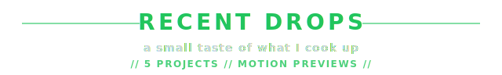

[![Aymane Bouljam banner][banner]][github]

[![Typing intro][typing]][github]

  //

  

  
  

  
  
  

  
  
  
  

  
  
  

  
  

  

  //

  

<table align="center">
  <tr>
    <td width="50%" valign="top">
      
01 // URBAN HAVEN

      <a href="https://github.com/bulljam/Urban-Haven" title="Open Urban Haven repository">
        <video src="./demo/urban-haven.mp4" autoplay loop muted playsinline preload="metadata" width="100%"></video>
      </a>
    </td>
    <td width="50%" valign="top">
      
02 // BRAVIO MEDIA

      <a href="https://github.com/bulljam/Bravio-Media" title="Open Bravio Media repository">
        <video src="./demo/bravio-media.mp4" autoplay loop muted playsinline preload="metadata" width="100%"></video>
      </a>
    </td>
  </tr>
  <tr>
    <td width="50%" valign="top">
      
03 // MAISON EMBER

      <a href="https://github.com/bulljam/Maison-Ember" title="Open Maison Ember repository">
        <video src="./demo/maison-ember.mp4" autoplay loop muted playsinline preload="metadata" width="100%"></video>
      </a>
    </td>
    <td width="50%" valign="top">
      
04 // EMERALD LEAF

      <a href="https://github.com/bulljam/Emerald-Leaf" title="Open Emerald Leaf repository">
        <video src="./demo/emerald-leaf.mp4" autoplay loop muted playsinline preload="metadata" width="100%"></video>
      </a>
    </td>
  </tr>
  <tr>
    <td width="50%" valign="top">
      
05 // FILMORAX

      <a href="https://github.com/bulljam/FilmoraX" title="Open FilmoraX repository">
        <video src="./demo/filmoraX.mp4" autoplay loop muted playsinline preload="metadata" width="100%"></video>
      </a>
    </td>
    <td width="50%" valign="top"></td>
  </tr>
</table>

  //

  

  

[![Aymane Bouljam footer][footer-banner]][github]

[banner]: https://capsule-render.vercel.app/api?type=waving&height=160&color=0:0f172a,45:111827,100:22c55e&animation=twinkling
[footer-banner]: https://capsule-render.vercel.app/api?type=waving&section=footer&height=120&color=0:0f172a,45:111827,100:22c55e&animation=twinkling&reversal=true
[github]: https://github.com/bulljam
[typing]: https://readme-typing-svg.demolab.com?font=Caveat&weight=700&size=30&pause=1200&color=22C55E&center=true&vCenter=true&width=980&lines=Yo%21+it%27s+your+boy+Aymane%2C+A.K.A.+Bulljam;Laravel+in+the+build%2C+PHP+ain%27t+dead%2C+still+feeding+the+fam;PostgreSQL+in+the+back%2C+every+query+hit+hard+like+a+slam;Next.js+on+the+polish%2C+clean+UI+so+smooth+it+don%27t+jam
