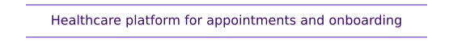
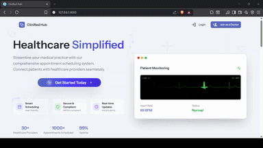
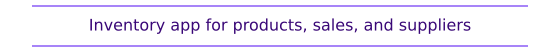
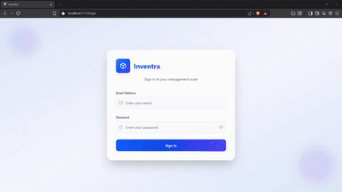
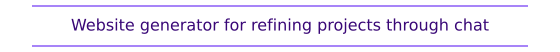
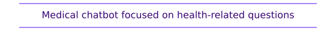
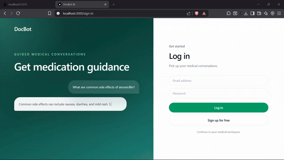

  <strong>Hi there, welcome to my hub 👋</strong>

━━━━━━━━━━━━━━━━━━━━━━━━━━

  <strong>
    <code>W H O&nbsp;&nbsp;I&nbsp;&nbsp;A M</code>
  </strong>

  My name is Aymane Bouljam. 
  I’m a full-stack developer who builds products and systems that streamline 
  workflows and solve real business problems.

  <strong>
    <code>T E C H&nbsp;&nbsp;S T A C K</code>
  </strong>

  Technologies I’ve worked with include 
  Laravel · Express.js · NestJS · React · Vue.js · Next.js 
  PostgreSQL · MySQL · MongoDB

 

  <strong>
    <code>F E A T U R E D&nbsp;&nbsp;W O R K</code>
  </strong>

  A selection of projects I’ve built.

  
<strong>Show Work</strong>

   

<table align="center" width="100%">
  <tr>
    <td width="50%" valign="top">
      
<strong>VYNCE</strong>

      

        <picture>
          <source media="(prefers-color-scheme: dark)" srcset="demo/descriptions/vynce.svg" />
          <source media="(prefers-color-scheme: light)" srcset="demo/descriptions/vynce-light.svg" />
          
        </picture>
         
        <code>Laravel · PostgreSQL · Inertia.js · React</code>
      

      
<a href="https://github.com/aymanebouljam/vynce" title="Open Vynce repository"><picture><source media="(prefers-color-scheme: dark)" srcset="https://cdn.simpleicons.org/github/FFFFFF" /><source media="(prefers-color-scheme: light)" srcset="https://cdn.simpleicons.org/github/24292F" /></picture></a>&nbsp;&nbsp;&nbsp;<picture><source media="(prefers-color-scheme: dark)" srcset="demo/descriptions/action-divider.svg" /><source media="(prefers-color-scheme: light)" srcset="demo/descriptions/action-divider-light.svg" /></picture>&nbsp;&nbsp;&nbsp;

      
    </td>
    <td width="50%" valign="top">
      
<strong>CLINIFIED HUB</strong>

      

        <picture>
          <source media="(prefers-color-scheme: dark)" srcset="demo/descriptions/clinified-hub.svg" />
          <source media="(prefers-color-scheme: light)" srcset="demo/descriptions/clinified-hub-light.svg" />
          
        </picture>
         
        <code>Laravel · MySQL · React · Material UI</code>
      

      
<a href="https://github.com/aymanebouljam/clinified-hub" title="Open Clinified Hub repository"><picture><source media="(prefers-color-scheme: dark)" srcset="https://cdn.simpleicons.org/github/FFFFFF" /><source media="(prefers-color-scheme: light)" srcset="https://cdn.simpleicons.org/github/24292F" /></picture></a>&nbsp;&nbsp;&nbsp;<picture><source media="(prefers-color-scheme: dark)" srcset="demo/descriptions/action-divider.svg" /><source media="(prefers-color-scheme: light)" srcset="demo/descriptions/action-divider-light.svg" /></picture>&nbsp;&nbsp;&nbsp;

      
    </td>
  </tr>
</table>

<table align="center" width="100%">
  <tr>
    <td width="50%" valign="top">
      
<strong>INVENTRA</strong>

      

        <picture>
          <source media="(prefers-color-scheme: dark)" srcset="demo/descriptions/inventra.svg" />
          <source media="(prefers-color-scheme: light)" srcset="demo/descriptions/inventra-light.svg" />
          
        </picture>
         
        <code>Express.js · MongoDB · React · Tailwind CSS</code>
      

      
<a href="https://github.com/aymanebouljam/inventra" title="Open Inventra repository"><picture><source media="(prefers-color-scheme: dark)" srcset="https://cdn.simpleicons.org/github/FFFFFF" /><source media="(prefers-color-scheme: light)" srcset="https://cdn.simpleicons.org/github/24292F" /></picture></a>&nbsp;&nbsp;&nbsp;<picture><source media="(prefers-color-scheme: dark)" srcset="demo/descriptions/action-divider.svg" /><source media="(prefers-color-scheme: light)" srcset="demo/descriptions/action-divider-light.svg" /></picture>&nbsp;&nbsp;&nbsp;

      
    </td>
    <td width="50%" valign="top">
      
<strong>VIRELIO</strong>

      

        <picture>
          <source media="(prefers-color-scheme: dark)" srcset="demo/descriptions/virelio.svg" />
          <source media="(prefers-color-scheme: light)" srcset="demo/descriptions/virelio-light.svg" />
          
        </picture>
         
        <code>NestJS · Prisma · PostgreSQL · Vue.js</code>
      

      
<a href="https://github.com/aymanebouljam/virelio" title="Open Virelio repository"><picture><source media="(prefers-color-scheme: dark)" srcset="https://cdn.simpleicons.org/github/FFFFFF" /><source media="(prefers-color-scheme: light)" srcset="https://cdn.simpleicons.org/github/24292F" /></picture></a>&nbsp;&nbsp;&nbsp;<picture><source media="(prefers-color-scheme: dark)" srcset="demo/descriptions/action-divider.svg" /><source media="(prefers-color-scheme: light)" srcset="demo/descriptions/action-divider-light.svg" /></picture>&nbsp;&nbsp;&nbsp;

      
    </td>
  </tr>
</table>

<table align="center" width="100%">
  <tr>
    <td width="50%" valign="top">
      
<strong>BUILDLY AI</strong>

      

        <picture>
          <source media="(prefers-color-scheme: dark)" srcset="demo/descriptions/buildly-ai.svg" />
          <source media="(prefers-color-scheme: light)" srcset="demo/descriptions/buildly-ai-light.svg" />
          
        </picture>
         
        <code>Next.js · SQLite · Prisma · Groq API</code>
      

      
<a href="https://github.com/aymanebouljam/buildly-ai" title="Open Buildly AI repository"><picture><source media="(prefers-color-scheme: dark)" srcset="https://cdn.simpleicons.org/github/FFFFFF" /><source media="(prefers-color-scheme: light)" srcset="https://cdn.simpleicons.org/github/24292F" /></picture></a>&nbsp;&nbsp;&nbsp;<picture><source media="(prefers-color-scheme: dark)" srcset="demo/descriptions/action-divider.svg" /><source media="(prefers-color-scheme: light)" srcset="demo/descriptions/action-divider-light.svg" /></picture>&nbsp;&nbsp;&nbsp;

      
    </td>
    <td width="50%" valign="top">
      
<strong>DOCBOT AI</strong>

      

        <picture>
          <source media="(prefers-color-scheme: dark)" srcset="demo/descriptions/docbot-ai.svg" />
          <source media="(prefers-color-scheme: light)" srcset="demo/descriptions/docbot-ai-light.svg" />
          
        </picture>
         
        <code>Next.js · SQLite · Prisma · Groq API</code>
      

      
<a href="https://github.com/aymanebouljam/docbot-ai" title="Open DocBot AI repository"><picture><source media="(prefers-color-scheme: dark)" srcset="https://cdn.simpleicons.org/github/FFFFFF" /><source media="(prefers-color-scheme: light)" srcset="https://cdn.simpleicons.org/github/24292F" /></picture></a>&nbsp;&nbsp;&nbsp;<picture><source media="(prefers-color-scheme: dark)" srcset="demo/descriptions/action-divider.svg" /><source media="(prefers-color-scheme: light)" srcset="demo/descriptions/action-divider-light.svg" /></picture>&nbsp;&nbsp;&nbsp;

      
    </td>
  </tr>
</table>

  <strong><code>O R</code></strong>

  <a href="https://github.com/aymanebouljam?tab=repositories"><strong>Explore more projects →</strong></a>

 

  <strong>
    <code>F I N D&nbsp;&nbsp;M E</code>
  </strong>

 

  
  

 

━━━━━━━━━━━━━━━━━━━━━━━━━━

Have something worth creating? Let’s build it. 🤝

